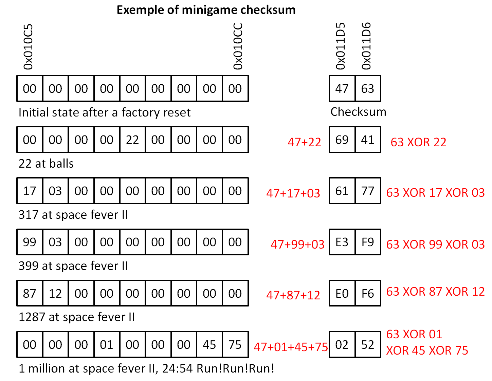

## All you want to know about the Game Boy Camera save format !

# Part 1: Injecting custom pictures into the save

So, despite the fact that extracting images from Game Boy Camera saves was made possible by fans since many years, it was virtually impossible in 2021 to do the inverse : inject custom pictures into saves. At least until now. What could be the interest, dear reader ? It can be usefull to mess with pixel perfect artworks, to reuse an image that was erased long ago from camera but still stored somewhere on a computer or internet or simply exchange pictures with friends if you have no friends, which is my case.

All codes given here are [GNU Octave](https://octave.org/) / Matlab compatible. GNU Octave is an open source version of Matlab, a langage for scientific computing. Codes are meant to be short and easy to use / modify from any of these multi OS development environments.

The small codes [presented here](https://github.com/Raphael-Boichot/Inject-pictures-in-your-Game-Boy-Camera-saves/tree/main/Codes%20Regular%20cameras) allows injecting custom pictures in any save. Here are the steps:
- Extract your save from Game Boy Camera with any great tool like the [GBxCart dumper](https://shop.insidegadgets.com/product/gbxcart-rw/);
- Scan your save with [**slot_viewer.m**](Codes%20Regular%20cameras/slot_viewer.m) to identify memory slots available for injection. By default an available slot is one ever occupied by an image. Game face and address 0 are also writable as slots 0 and -1 respectively (they are by default active);
- In option, activate all memory slots with [**slot_activator.m**](Codes%20Regular%20cameras/slot_activator.m) if you want to occupy any slot on camera. Blank slots will become white images, erased images will appear again, images will be numbered according to their address in memory;
- Prepare a 128x112 (ore 128x128 for slot -1) image and a 32x32 pixels thumbnail (optional), 4 shades of gray;  
- Inject the two pictures at once with [**image_injector.m**](Codes%20Regular%20cameras/image_injector.m) into any desired memory slot;
- You can check again the success of image injection with [**slot_viewer.m**](Codes%20Regular%20cameras/slot_viewer.m);
- Burn your modified save into the Game Boy Camera;
- Enjoy your new image and play with stamps;
- You can additionnaly extract your images from save in .png format with [**image_extractor.m**](Codes%20Regular%20cameras/image_extractor.m);

The scanning code basically extracts and analyses values at addresses 0x011B2 to 0x011CF that contains the state and numbering of any image slot on the save (which I will call **"State Vector"** because it had no name until now). These data are also duplicated from addresses 0x011D7 to 0x011F4. Any number between 0x00 and 0x1D on this state vector represents the image number (minus one) that shows on the camera screen, FF is an unused slot (erased of never used). The number assignated to an image on camera is in consequence not related to the slot number (or physical address). Deleting an image on camera will simply write 0xFF on the vector state at the good place and all images will be renumbered dynamically, but image data stay on their respective slots as long as another image is not written on it. When a picture is taken, memory slots marked as unused on the vector state will be used by writing data in priority to the lowest address one. Next image illustrates the principle of this state vector:

Until this step, everything was fine and easy, tricky enough to occupy my brain for an evening but not much. Here came some very bad undocumented surprise. There is an **undocumented checksum system** at addresses 0x011D5-0x011D6 and 0x011FA-0x011FB that precludes any possibility of un-erasing a single picture or activating a new memory slot by simply manipulating the state vector (except as a whole as in this case the checksum is known). Doing this simply forces the camera to replace any value on state vector by 0xFF (means you've basically fucked your precious images in case you just own original hardware in 1998).

This is why I wrote [slot_activator.m](Codes%20Regular%20cameras/slot_activator.m), which activates all slots (an unerases all pictures). This was the only operation that I was initially able to perform, knowing the checksum of this particular state vector. For doing this, I simply stuff addresses 0x011B2 to 0x011CF with a fake "camera full" state vector (0x00, 0x01, 0x02 ...0x1C, 0x1D) and addresses 0x011D5-0x011D6 with the corresponding checksum (0xE2, 0x14). Et voilà ! This means that range 0x011D7 to 0x011F4 and addresses 0x011FA-0x011FB are just echos. Activating the 30 slots of a camera after a factory reset gives you 30 white images.

## Hexadecimal codes to unerase all picture

Hopefully, I've found that an active image could be replaced bytewise without activating any suicide code. In consequence, the image injection code just substitutes the data corresponding to the image tiles (address range : 0xXX000-0xXXDEF for the image, address range : 0xXXDF0-0xXXEFF for the thumbnail, XX ranging from 02 to 1F). Additionnal data (range 0xXXF00-0xXXFFF), are not modified. Apart from that, data are arranged in Game Boy tile format, tile after tile, in reading order, so nothing particular for you Nintendo nerds.

Funfact, the thumbnail is dynamically rewritten each time the image is saved into the Game Boy Camera, even if just one pixel is changed. So I just provide a generic image thumbnail that will soon disappear. Invigorated by my half-a-success, I took a look around the state vector in search for any minigame score to manipulate (that damn mole is too fast !), following the word "Magic" into the save signing the presence of interesting stuff. This is where another form of pain begins.

## This was the easy part, now began the tricky one

# Part 2: breaking the data encoding system just for science

I loosely continued collecting data to understand how bytes are arranged into the savestate (see [research folder](Research)). The principle reason is that it seems that there is not any single cheating codes on the whole planet Earth for this device (except the [CoroCoro save hack](https://tcrf.net/Game_Boy_Camera) that targets one of the rare unprotected range), even more than 25 years after the camera was released, which is quite annoying when you know the requirement to unlock the full B album (Yes, accomplish 1000 points at Ball, 7000 points at Space Fever II and less that 16 seconds at Run! Run! Run! means you were at some point of your life stuck at home with two broken legs and only a Game Boy to entertain yourself, believe me). So my motivation to crack the thing was rather strong. 

My general (tedious) strategy was to compare different dumped savesates with some accomplishments made (not all, I'm not mad nor stuck at home with broken legs), byte per byte, to understand where were the targeted addresses. I systematically compared with a blank savestate (all data erased). Everything was made on real hardware (Game Boy Camera and Pocket Camera in parallel). So here are my conclusions: 

- The Game Boy Camera save uses several internal checksums systematically echoed to protect its own data : one for scores (minigames and counter for images), one for controlling the vector state and prevent any erased or transfered image to be recovered by byte attack (as data still exist in memory slots), one for camera owner informations and one for picture owner informations (In case the picture was exchanged). This means that when you play with a Gameboy Camera, you play with the rules. That may explain the scarcity, even the total absence of cheat codes for the Camera. The beast is robust !

- Each checksum have two bytes corresponding to two different calculation rules (see next sections) and is preceded by the ascii word "Magic" (a kind of crual programmer joke probably);

- Any discrepancy between data, scores, states and checksums causes the camera to erase all informations into the save at reboot (camera must consider the savestate as corrupted or modified by cheating). Everything is set to zero, end of story, reward for cheating. I think that the long booting time of the Game Boy Camera is precisely due to the amount of verifications/rewrite made; 

- Data protected by checksums are systematically echoed but first occurence seems to have priority on its echo (modifying the first occurence with correct checksum is enough to modify safely the save file);

- I suppose that all of this (obfusctation + checksum with different rules) was implemented as some Game Genie, Gameshark or other cheating hardware counter measure as it is twisted as hell. Clearly a single byte attack will inevitably lead to the activation of a **suicide code** as at least three bytes must be modified to hack something (one byte of data + 2 bytes of checksum);

- On the contrary, the data corresponding to picture tiles stored in memory slots of camera are not protected by any way (as well as Game Face data);

- Forcing the minigame scores in memory with the correct checksum is enough to unlock image B album, there is no other trick necessary;

- Good new, Pocket Camera and Game Boy Camera seems to have the exact same save structure. They are fully intercompatibles.

- Funfact:  the beginning of the save ram acts as an image buffer in which everything seen by the sensor and displayed on screen is copied. This means than when you stop the camera, the last image buffered stay in memory as long as you do not display the camera image onscreen again. This image can be extracted (or modified) as easily as another. So when you buy a camera, dump the save BEFORE testing the camera for weird (or cringe) surprises.

- It was a bit tedious to do this on original hardware as [BGB emulator](https://bgb.bircd.org/) is reliable enough to do mostly the same more rapidely...

So I can now propose a revised structure of the Game Boy Camera save format since [Jeff Frohwein](https://www.devrs.com/gb/files/gbcam.txt) proposed the first one in the early 2000's.

## Game Boy Camera save ram format by increasing adresses

- **0x00000-0x00FFF: the last image seen by the sensor (128x128 pixels, 256 tiles). The camera copies 0x0100-0x0EFF to memory slots when save is activated. The effective visual resolution is only 128x123 as indicated in the datasheet of the M64282FP sensor. The 5 missing lines (at the bottom of image) gather the signal of pixels physically masked on the sensor intended to measure the residual dark voltage. How to use this signal for practical calibration of the sensor is unclear in its documentation;**
- **0x01000-0x010D8: Animation settings, Trippy H and minigames save area, see details:**
    - *0x01000-0x0102E: animation slots 1-47 (index 0-29. MSB=1 for album B);*
    - *0x0102F: animation loop flag;*
    - *0x01030-0x0105E: animation loops (loop start 0x80 + loop time), between (loop time 0x02-0x32), (loop end 0x40 + loop time);*
    - *0x0105F: animation speed;*
    - *0x01060: animation border;*
    - *0x01061: SOUND I - from MSB to LSB-> unknown (2 bits), duty length (2 bits), gate (4 bits);*
    - *0x01062: SOUND I - env. from MSB to LSB-> U/D (1 bit), time (3 bits), gain (4 bits);*
    - *0x01063: SOUND I - mod. from MSB to LSB-> square or sine (1 bit), dep. (7 bits);*
    - *0x01064: SOUND I - mod. from MSB to LSB-> ? (1 bit), freq.  (7 bits);*
    - *0x01065-0x01074: SOUND I - notes (range 0x01-0x25);*
    - *0x01075-0x01078: SOUND I - stereo option for the 16 notes (2 bits per note, default 0x55, center);*
    - *0x01079-0x01088: SOUND II - 32 values for wave enveloppe (16 bytes, 16 levels by group of 4 bits);*
    - *0x01089: SOUND II - from MSB to LSB-> unknown (2 bits), wave pattern (2 bits), env. g. (4 bits);*
    - *0x0108A: SOUND II - mod. from MSB to LSB-> square or sine (1 bit), dep. (7 bits);*
    - *0x0108B: SOUND II - mod. from MSB to LSB-> ? (1 bit), frq. (7 bits);*
    - *0x0108C-0x0109B: SOUND II - notes (range 0x01-0x025);*
    - *0x0109C-0x0109F: SOUND II - stereo option for the 16 notes (2 bits per note, default 0x55, center);*
    - *0x010A0: loop count - from MSB to LSB-> SOUND I (4 bits), SOUND II (4 bits);*
    - *0x010A1: NOISE - env. from MSB to LSB-> U/D (1 bit), unknown (3 bits), gain (4 bits);*
    - *0x010A2: NOISE - from MSB to LSB-> gate (4 bits), loop count (4 bits);*
    - *0x010A3-0x010B2: NOISE - notes (range 0x01-0x025);*
    - *0x010B3-0x010B6: NOISE - stereo option for the 16 notes (2 bits per note, default 0x55, center);*
    - *0x010B7-0x010B8: unknown area (seems unused);*
    - *0x010B9: Tempo;*
    - *0x010BA: 0x01 if any partition is saved, 0x00 either;*
    - *0x010BB-0x010BC: counter for image taken (on 2x2 digits reversed);*
    - *0x010BD-0x010BE: counter for image erased (on 2x2 digits reversed);*
    - *0x010BF-0x010C0: counter for image transfered (on 2x2 digits reversed);*
    - *0x010C1-0x010C2: counter for image printed (on 2x2 digits reversed);*
    - *0x010C3-0x010C4: counter for pictures received by males an females (2x2 digits);*
    - *0x010C5-0x010C6: Score at Space Fever II (on 4x2 digits reversed);*
    - *0x010C9-0x010CA: score at balls (on 2x2 digits reversed);*
    - *0x010CB-0x010CC: score at Run! Run! Run! (on 2x2 digits reversed, 99 minus value on screen);*
    - *0x010CD-0x010CF: unknown data (seems never used);*
    - *0x010D0: printing intensity (0x00 min, 0x040 typical, 0x7F maximum);*
    - *0x010D1: unknown data;*
    - *0x010D2-0x010D6: "Magic" word in ascii;*
    - *0x010D7-0x010D8: checksum (2 bytes, see next section, range of data included 0x01000-0x01D6, starting seed: "Magic" followed by 0x2F, 0x15);*
- **0x010D9-0x011B1: Animation settings, Trippy H and minigames save area,  echo of 0x01000-0x010D8;**
- **0x011B2-0x011D6: vector state, see details:**
    - *0x11B2-0x011CF: image number associated to memory slots (minus one), 0xFF means erased or blank;*   
    - *0x11D0-0x011D4: "Magic" word in ascii;*
    - *0x11D5-0x011D6: checksum (2 bytes, see next section, range of data included 0x11B2-0x011D4, starting seed: "Magic" followed by 0x2F, 0x15);*
- **0x011D7-0x011FB: vector state, echo of 0x011B2-0x011D6;**  
- **0x011FC-0x01FFB: Game Face (128x112) - This area is not erased by booting while pressing START+SELECT;**
- **0x01FFC-0x01FFF: Possible camera tag (0x00, 0x56, 0x56, 0x53 to unlock Corocoro features in Pocket Camera) - This area is not erased by booting while pressing START+SELECT (hopefully for the owners of the feature);**
- **0x02000-0x02DFF: image data tiles in memory slot 1 (128x112, 224 tiles);**
- **0x02E00-0x02EFF: image thumbnail (32x32, 16 tiles, black borders and 4 white lines on the bottom to not hide the hand). Image exchanged displays a small distinctive badge;**
- **0x02F00-0x02FFF: image tag or metadata (contains informations on the owner of camera and image);**
- **0x02F00-0x02F5B : User ID, data, comments and some other information from image owner**;
    - *0x02F00-0x02F03: user ID, 4 bytes sequence (equal to 11 + series of two digits among 8 in reading order);*
    - *0x02F04-0x02F0C: username (0x56 = A to 0xC8 = @, same tileset as first character stamps);*
    - *0x02F0D: User gender (0x00 no gender, 0x01 male, 0x02 female) and blood type (japanese only, +0x04 A, +0x08 B, +0x0C O, +0x10 AB);*
    - *0x02F0E-0x02F11: Birthdate (year, 2x2 bytes, day, 2 bytes, month, 2 bytes, each 2 bytes + 11);*
    - *0x02F12-0x02F14: 3 unknown bytes;*
    - *0x02F15-0x02F2F: Contains comments (0x56 = A to 0xC8 = @, same tileset as first character stamps);*
    - *0x02F30-0x02F32: 0x00;*
    - *0x02F33: 0x00 if image is original, 0x01 if image is a copy;*
    - *0x02F34-0x02F35: Probably a checksum from image data to detect modifications and trigger save menu. Two identical image copies have the same value;*
    - *0x02F36-0x02F3A: 0x01 if hotspot is activated among 5 possible (0x00 otherwise);*
    - *0x02F3B-0x02F3F: xpos of the 5 hotspots, range 0x00-0x0E;*
    - *0x02F40-0x02F44: ypos of the 5 hotspots, range 0x00-0x0C;*
    - *0x02F45-0x02F49: sound effects and music associated to the 5 hotspots, range 0x00-0x3F, 0xFF for Off;*
    - *0x02F4A-0x02F4E: visual effects associated to the 5 hotspots, range 0x00-0x06, 0xFF for Off;*
    - *0x02F4F-0x02F53: jump to image XX, range 0x00-0x1D, 0xFF for Off;*
    - *0x02F54: border number associated to the image;*
    - *0x02F55-0x02F59: "Magic" word in ascii;*
    - *0x02F5A-0x02F5B: checksum (2 bytes, range of data included 0x02F00-0x02F59, starting seed: "Magic" followed by 0x2F, 0x15);*
- **0x02F5C-0x02FB7: User ID, data, comments and some other information from image owner, echo;**
- **0x02FB8-0x02FD0: User ID and data from camera owner (below the first image only, slot 1, just replaced by 0xAA on other slots);**
    - *0x02FB8-0x02FBB: User ID;*
    - *0x02FBC-0x02FC4: Username (0x56 = A to 0xC8 = @, same tileset as first character stamps);*
    - *0x02FC5: User gender (0x00 no gender, 0x01 male, 0x02 female) and blood type (japanese only, +0x04 A, +0x08 B, +0x0C O, +0x10 AB);*
    - *0x02FC6-0x02FC9: Birthdate (year, 2x2 bytes, day, 2 bytes, month, 2 bytes, each 2 bytes + 11);*
    - *0x02FCA-0x02FCE: "Magic" word in ascii;*
    - *0x02FCF-0x02FD0: checksum (2 bytes, range of data included 0x02FB8-0x02FCE, starting seed: "Magic" followed by 0x2F, 0x15);*
- **0x02FD1-0x02FE9: User ID data echo (below the first image only, slot 1, just replaced by 0xAA on other slots);**
- **0x02FEA-0x02FFF: end of memory slot;**          
    - *0x02FEA-0x02FEF: 0xAA repeated;*
    - *0x02FF0-0x02FF1: 0xAA repeated, but not always;*
    - *0x02FF2-0x02FFF: 0xAA repeated or sensor calibration vector under image slot 5 (0x04FF2-0x04FFF) and image slot 18 (0x11FF2-0x011FFF, echo).*
    - *0X02FFF: changes with hotspots and events in the camera;*

**Images are then repeated from 0xXX000 to 0xXXFFF with XX ranging from 03 to 1F.**

**Image slot 5 (range 0x04FF2-0x04FFF) contains calibration data for camera, echoed in image slot 18 (range 0x11FF2-0x011FFF). To trigger auto-calibration, fill these ranges with 0xAA and boot the camera in the dark. The function of these calibration bytes is not fully understood as modifying them can lead to glitchy images, but I'm not able to recognize a particular pattern.**

General comment: any extended 0xAA range is a remnant of the initial factory sram tests, never erased since camera release. Other value means that backup battery has been replaced one time in the camera life. By extension, these ranges are never included into any checksums as they are never used by the camera code in writing mode.

## Visual representation of data at the beginning of the sram

          
## Now let's finally reverse engineer this damn checksum system !

OK, at this point I was curious to understand how the checksum system worked (it was even a matter of honor). It was not a two bytes checksum like the Game Boy Printer protocol for sure, But some savestates comparisons showed that increasing values of scores or pictures taken always increased the left byte of the cheksum (low address). So this one was just a sum on 8 bits. The right byte (high address) had a weird behavior. I've tried all the common operators available in assembly and XOR was (of course) the good one. So left byte is a 8-bit sum and right byte a 8 bit XOR of values considered in the checksum. The rule to modify any byte in an area protected by checksum is the following:

- **modify the old byte value by a new byte value;**
- **modify the left byte of its checksum like this: old checksum byte+(new byte value-old byte value);**
- **modify the rigth byte of its checksum like this : old checksum byte XOR old byte value XOR new byte value;**

And that's all ! The checksum could be calculated from scratch from always the same seed: "Magic" followed by 0x2F, 0x15 (starting checksum when all data are 0x00). Each new data entering a protected area modifies the values of its corresponding checksum according to the rules. "Magic" is a mandatory keyword (its absence triggers the suicide code even if the checksum is correct).

## Starting seed for ALL camera checksums

If "Magic" is included into the checksum and replaced by 5x 0x00, it becomes simply 0x4E, 0x54 ("NT" in Ascii).

Well enough to enjoy all the crappy images of the B album of the camera (At least in the international version, Gold and Japanese are a bit better). [This folder](Glitched%20save%20creator) contains self-explanatory code to transform any 128 kB file in legit save. [This folder](Universal%20cheater%20all%20cameras) contains a code that generate an **universal save unlocking all the features of all the camera versions** starting from any of your prefered save.

## Example of state vector checksum attack

## Example of Minigame checksum attack

## Examples of score attack on real hardware

# Part 3: Calibrating the sensor

A secret factory menu have been discovered in december 2021 independently by me and [Cristofer Cruz](https://github.com/cristofercruz): by pressing all inputs (4 directions included, I know this is completely stupid) at the same time when booting, or by filling the sram with 0xAAs on real device, the camera enters a factory reset mode saying "STORE PLEASE WAIT", then "STORE END" and playing a Run!Run!Run jingle. The exact purpose of this menu have been discovered by serendipity the 7 august 2022 from a [glitched save](/Research/Save_with_exposure_glitch.sav) that changes the sensor auto-exposure rules: this is a calibration menu.

During this procedure, the camera sensor is activated and the game stores data in the range 0x04FF2-0x04FFF, echoed at the range 0x11FF2-0x011FFF. By comparing this vector extracted from new cameras (new old stocks) and cameras placed in different lightning conditions during this calibration procedure, it has been established that these data are probably setpoints or offsets for guiding the auto-exposure of the camera calculated from activating the sensor in the dark in different conditions.

So for calibrating the camera, you must proceed as following:

**Method 1:**
- Write to the sram a save filled with 0xAA (you can download one [here](Research/DUMB_AA.sav));
- Place your camera in complete dark and boot it;
- Wait for the ending jingle (take about 10-20 seconds);
- Reboot your camera and enjoy its fresh calibration.

**Method 2:**
 - Just burn [this custom save](Universal%20cheater%20all%20cameras/Universal_unlocking_save.sav) and boot your Game Boy in the dark. It will calibrate the sensor, unlock B album and CoroCoro features at the same time.
- Reboot your camera and enjoy its new features.

This should be made after battery loss/replacement as non-calibrated cameras can behave weirdly.

# Part 4: some random stuff for camera nerds
## 2021-07-01 Update: structure of the Hello Kitty Pocket Camera save

Thanks to Cristofer Cruz who built a real Hello Kitty Pocket Camera from the dead body of a Pocket Camera and a MX27C8000 EPROM, we were able to explore the SRAM structure from various dumps. The save format is about the same than the Game Boy Camera with some exceptions: 

- **0x00000-0x00FFF: same as Game Boy Camera**
- **0x01000-0x011B1: game save data (NOT PROTECTED), see details:**
    - *0x01000-0x01001: counter for image taken (on 2x2 digits reversed);*
    - *0x01002-0x01003: counter for image erased (on 2x2 digits reversed);*
    - *0x01004-0x01005: counter for image transfered (on 2x2 digits reversed);*
    - *0x01006-0x01007: counter for image printed (on 2x2 digits reversed);*
    - *0x01008-0x01009: counter for pictures received by males an females (2x2 digits);*
    - *0x0100A-0x0100C: counter for Kitts (on 3x2 digits reversed);*
    - *0x0100D-0x01011: Unknown data;*
    - *0x01012-0x01016: "Magic" word in ascii with NO CHECKSUM after, data are not protected;*
    - *0x01017-0x011B1: 0x00;*
- **0x011B2-0x011D6: vector state, same as Game Boy Camera, protected with checksum;**
- **0x011D7-0x011FB: vector state, echo of 0x011B2-0x011D6;**
- **0x011FC-0x0187B: user profile 3 photos animated, 40x56 pixels (5x7 tiles), written consecutively;**
- **0x0187C-0x01FFF: 0x00;**
- **0x02000-0x1FFFF: same as Game Boy Camera;**

The counter for images is followed by a nice flower meter just below. I think that the game save data are not protected just because the game is not finished. Indeed, the "Magic" word exists but without checksum after and the game save data are not echoed contrary to the state vector that may originate from the old Game Boy Camera code the Hello Kitty is based on. Moreover, game save data are written in address range 0x01000-0x0102E wich corresponds to animation settings in the regular Game Boy Camera (so it will mess all minigames data if you change the rom as checksum won't be updated properly).

These minor ram save format inconsistencies mean that switching from regular rom to HK rom with the same save is OK, but switching back will probably wipe your records if you catch any "kitt", the rom "currency". Images are anyway always conserved.

Save functionality of the leaked rom was probably enough for running and testing the game but not "polished" for antipiracy and public release. Structure of the sram, very similar to the Game Boy Camera, reinforces the idea that this version is more a port of the GB Camera than a complete reboot.

It was also observed that the image is overall "smoother" (in a not pleasant way I should admit) with this camera rom (hardware being the same) which probably involves some subtle modifications of sensor registers or dithering tables compared to regular roms. I've never investigated more on this point as I guess that nobody (included me) cares of that in fact.

Funfact: as the number of borders in HK rom is higher than in regular roms (and checksum correctly updated for this entry in HK rom), you can save a value from HK rom not supported by regular rom. This leads to an incorrect address to tilemap and very interesting glitched borders appear.

## Byte attack on HK Pocket Camera (Created by [Cristofer Cruz](https://github.com/cristofercruz))

## 2023-05-20 Update: structure of the Debagame Tester - Second Impact

A prototype of Game Boy Camera has been found on Ebay in may 2023. Images of the device are [archived here](https://archive.org/details/gbcam-debug-cart). It has a main menu very similar with the [MBC5 mapper chip test program](https://twitter.com/WaluigiBSOD/status/1659914999765008384?s=20) linked in 2020. Most intersting things are within the rom as it contains [quite a lot of hidden features](https://tcrf.net/Proto:Game_Boy_Camera) like programmer faces, unused graphics and [pieces of assembly code with comments](/Codes%20Debagame%20Tester%20-%20Second%20Impact/Debagame_tester_code_translated.txt). I rapidely checked the save format:

- **0x00000-0x00FFF: same as Game Boy Camera, ram exchange data;**
- **0x01000-0x01FFF: remnants of the ram read/write and aging test;**
- **0x02000-0x02DFF: image data tiles in first memory slot (128x112, 224 tiles);**
- **0x02E00-0x02FFF: image tag or metadata (mostly empty but 0x02FE8-0x02FFF contains data of unknown purpose);**
- **0x02000-0x1FFFF: overall the same as the Game Boy Camera, images are stored exactly at the same offsets**

Summary of some tests made on real hardware:
- The camera writes nothing in ram at boot;
- It allows accessing any memory slot in GALLERY mode, so it does not keep track of the slots occupied except than locally in software;
- Aging test can be made only by writing saves with [certain patterns more or less convoluted](Codes%20Debagame%20Tester%20-%20Second%20Impact). It must be possible to generate them onboard but I did not find how;
- Many functions let no traces in ram so I cannot really document their effect at the moment;
- The MOVIE function allows trying register configurations and dithering patterns not available in the original rom;
- Looks like image metadata does not contain the registers used at first glance. Maybe some control sums and comments.

My overall impression is that the 10.24 version (the only known to date) lacks several key features as some menus lead to dead end and/or have no effects (aging, printing, data protection, etc.). It was probably a very early version used to play with the sensor outside, the main dev being probably continued on a test board with EPROMs. It's surprising in the other hand to have such a close-to-definitive hardware design equipped with a mask ROM of such a primitive camera version. I mean, an EPROM would be enough for the task.

## The Debagame Tester

## Aknowledgments
- [Cristofer Cruz](https://github.com/cristofercruz) for helping with mapping some tricky sram area, making the HK pocket camera as soon as it leaked and testing my janky sram hacks.
